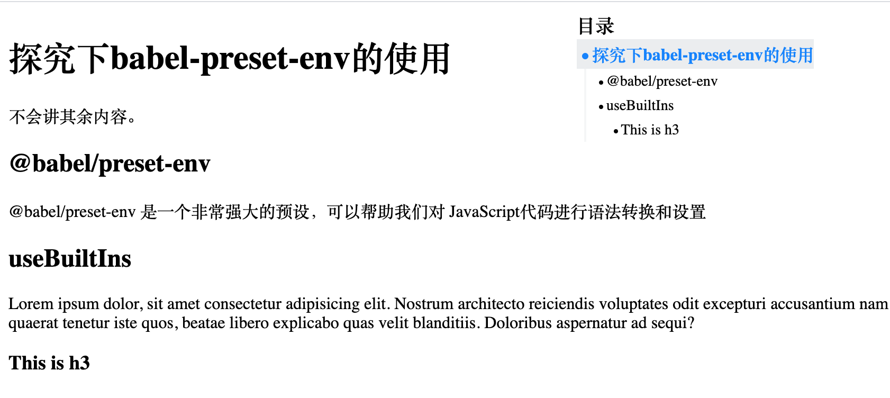

## Usage

> npm i vue-side-catalogue

``` js
<template>
  <div>
    <div id="content">
      <h1>探究下babel-preset-env的使用</h1>
      <p>不会讲其余内容。</p>
      <h2>@babel/preset-env</h2>
      <p>@babel/preset-env 是一个非常强大的预设，可以帮助我们对 JavaScript代码进行语法转换和设置</p>
      <h2>useBuiltIns</h2>
      <p>Lorem ipsum dolor, sit amet consectetur adipisicing elit. Nostrum architecto reiciendis voluptates odit excepturi accusantium nam quaerat tenetur iste quos, beatae libero explicabo quas velit blanditiis. Doloribus aspernatur ad sequi?</p>
      <h3>This is h3</h3>
    </div>
    <Catalog content="#content">
  </div>
</template>

import Catalog from 'vue-side-catalogue'

export default {
  components: {
    Catalog,
  },
}
```


